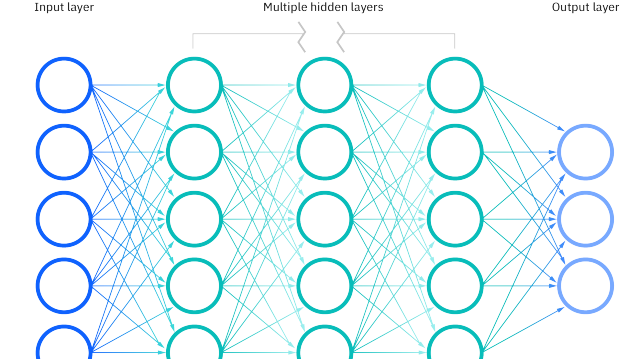
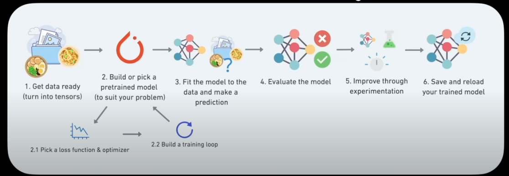

# **Deep Learning & PyTorch**

So PyTorch is a machine learning/deep learning module in Python. Deep learning is an application of artificial intelligence, useful within the context of unstructured data - compared to machine learning which favours structured data and supervised learning.

Deep learning is often programmed into "neural networks".

### *What is a neural network?*

1. For some unstructured data (for example: natural language, images, audio files etc.), that exists as data not in rows and columns, we turn this data into numbers via some form / method of numerical encoding.
   This might be stored in the form of a **matrix** or a **tensor**.

A neural network might look like this:

    Input					Multiple middle layers				    	Output

2. Within the neural network, a lot numerical operations allow for learning to take place; this includes pattern recognition, features, weights etc. We **do not define** what the machine learns.
3. The neural network learns a set of rules / patterns that it thinks best describes and interprets the input data, and represents that with output - again with matrices or tensors.
4. Programmers can convert these deep learning outputs into human-readable information; going from matrices / tensors / numbers to natural language, images or sound.

Input --> Hidden Layer(s)* --> Output

    *Each layer is usually a combination of linear and non-linear functions.
						*"Patterns" is arbituary term, but means similar things to "embedding", "weights", "feature representation" and "feature vectors".

### *What is/Why is PyTorch?*

A popular research deep learning framework used by many big companies such as Meta (in-house), now open-source and used by Tesla, Microsoft, OpenAI and others.

Helps to write fast deep learning code in Python, and create whole stacks; to preprocess data, model data, and deploy models in applications and clouds.

Consider checking out: paperswithcode.com/trends

### *What is a Tensor?*

Wikipedia says:
"*In [mathematics](https://en.wikipedia.org/wiki/Mathematics "Mathematics"), a **tensor** is an [algebraic object](https://en.wikipedia.org/wiki/Mathematical_object "Mathematical object") that describes a [multilinear](https://en.wikipedia.org/wiki/Multilinear_map "Multilinear map") relationship between sets of algebraic objects related to a [vector space](https://en.wikipedia.org/wiki/Vector_space "Vector space"). Tensors may map *[relationships] *between different objects such as [vectors](https://en.wikipedia.org/wiki/Vector_(mathematics_and_physics)) "Vector (mathematics and physics)"), [scalars](https://en.wikipedia.org/wiki/Scalar_(mathematics)) "Scalar (mathematics)"), and even other tensors.*

*Tensors are defined [independent](https://en.wikipedia.org/wiki/Tensor_(intrinsic_definition)) "Tensor (intrinsic definition)") of any [basis](https://en.wikipedia.org/wiki/Basis_(linear_algebra)) "Basis (linear algebra)"), although they are often referred to by their components in a basis related to a particular coordinate system; those components form an array, which can be thought of as a high-dimensional matrix.*"

A tensor could be (almost) any representation of numbers.

## *The Workflow*

